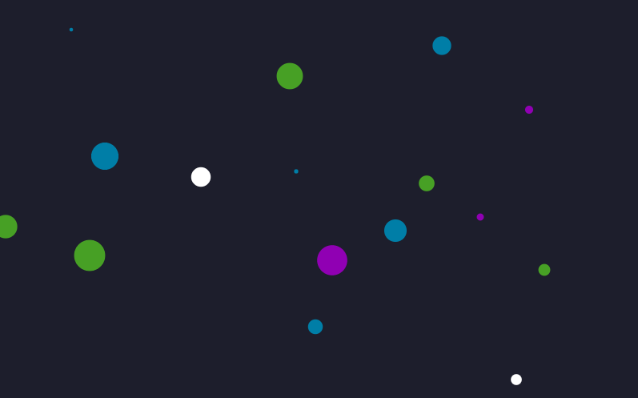

<div align="center">
    <h1>Bubble background</h1>
    
</div>

<br/>

# What's that
Bubble background is a tiny library for make a bubble effect in the canvas, the code is resumed in a class that just need be instantiated receiving the correct arguments. The bubble effect is like in the image above, circles growing up and shirinking until disappear from canvas, the background color, bubble's color, bubble's radius and bubble's spawn rate is programmable.


# How to use
First of all, you need import the BubbleAnimation.js to your .html file and then run the following commands in a script above:

```html
    <!--Importing the animation file-->
    <script src="./BubbleAnimation.js"></script>
    <script>
        // Get canvas element
        let canvas = document.getElementById("target_canvas");

        /* 
            You should define the canvas size here,
            if the canvas's CSS is defined as dynamic 
            size like using '%' you could use 'getComputedStyle'
            to redefine these variables every time that be
            changed
        */ 
        canvas.width = 500;
        canvas.height = 500;

        /* Call the animation class properly, passing
        the canvas element, all possible colors of bubbles,
        max bubble's radius, growing step of bubbles, bubbles's
        spawn rate and then the background color*/
        new BubbleAnimation(canvas, ["black", "purple", "gray", "blue", "red"], 30, 0.2, 600, "darkslateblue");

        // The program should run now :)
    </script>
```